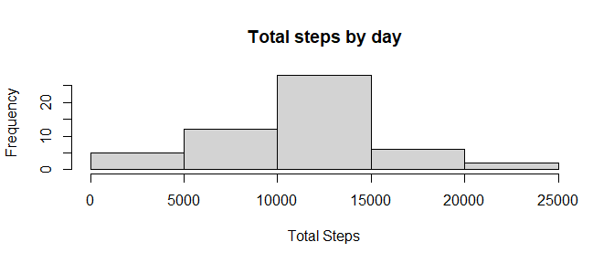
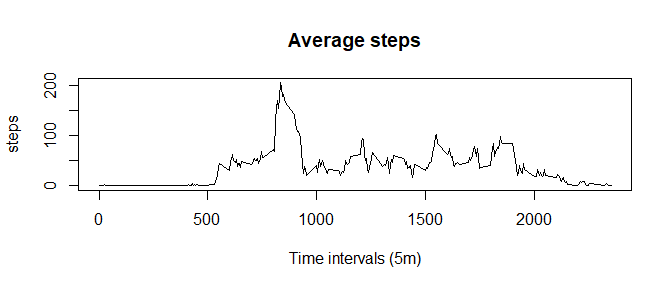
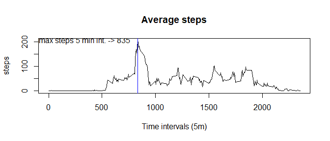
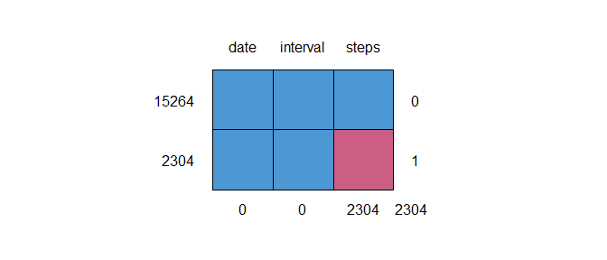
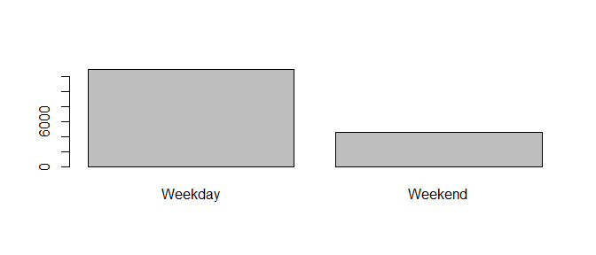
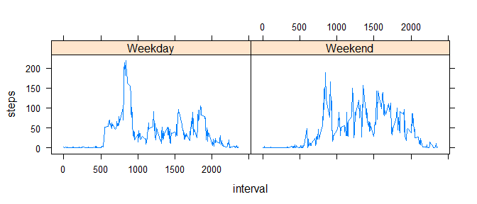

## Loading and preprocessing the data

```r
library(datasets)
# get rmarkdown directory
path<-getwd()
# set working directory
setwd(path)
#unzip data
unzip('activity.zip',exdir = 'data')
# load the data
df_activity<-read.csv2(file = 'data/activity.csv',sep = ',')
str(df_activity)
```

```
## 'data.frame':	17568 obs. of  3 variables:
##  $ steps   : int  NA NA NA NA NA NA NA NA NA NA ...
##  $ date    : chr  "2012-10-01" "2012-10-01" "2012-10-01" "2012-10-01" ...
##  $ interval: int  0 5 10 15 20 25 30 35 40 45 ...
```


## What is mean total number of steps taken per day?
### Total steps per day

```r
totalSteps<-aggregate(steps~date,data=df_activity,FUN = sum)
hist(totalSteps$steps,xlab = 'Total Steps',main = 'Total steps by day')
```

<!-- -->

### mean and median total steps

```r
meanTotalSteps <- mean(totalSteps$steps)
medianTotalSteps <- median(totalSteps$steps)
print(paste('Mean total steps:',meanTotalSteps))
```

```
## [1] "Mean total steps: 10766.1886792453"
```

```r
print(paste('Median total steps:',medianTotalSteps))
```

```
## [1] "Median total steps: 10765"
```


## What is the average daily activity pattern?


```r
totalSteps<-aggregate(steps~interval,data=df_activity,FUN = mean)
plot(steps~interval,data = totalSteps, type = 'l',xlab = 'Time intervals (5m)',main = 'Average steps')
```

<!-- -->

### Which 5-minute interval, on average across all the days in the dataset, contains the maximum number of steps?

```r
library(dplyr)
```

```
## 
## Attaching package: 'dplyr'
```

```
## The following objects are masked from 'package:stats':
## 
##     filter, lag
```

```
## The following objects are masked from 'package:base':
## 
##     intersect, setdiff, setequal, union
```

```r
plot(steps~interval,data = totalSteps, type = 'l',xlab = 'Time intervals (5m)',main = 'Average steps')
#see where is max
max(totalSteps$steps)
```

```
## [1] 206.1698
```

```r
# filter data
maxSteps<-totalSteps %>% filter(steps==max(totalSteps$steps))
abline(v=maxSteps[,'interval'], col="blue")
text(x=maxSteps[,'interval']-500,y=max(totalSteps$steps),labels=paste('max steps 5 min int. ->',maxSteps[,'interval']))
```

<!-- -->

## Imputing missing values

We are going to use MICE package
### report the missing values

```r
library(mice)
```

```
## 
## Attaching package: 'mice'
```

```
## The following object is masked from 'package:stats':
## 
##     filter
```

```
## The following objects are masked from 'package:base':
## 
##     cbind, rbind
```

```r
md.pattern(df_activity)
```

<!-- -->

```
##       date interval steps     
## 15264    1        1     1    0
## 2304     1        1     0    1
##          0        0  2304 2304
```

There are 15264 observations without missing values and 2304 with missing values in steps


```r
# we are going to use random forest for values imputation
x<-mice(df_activity, m=5, method = 'rf')
```

```
## 
##  iter imp variable
##   1   1  steps
##   1   2  steps
##   1   3  steps
##   1   4  steps
##   1   5  steps
##   2   1  steps
##   2   2  steps
##   2   3  steps
##   2   4  steps
##   2   5  steps
##   3   1  steps
##   3   2  steps
##   3   3  steps
##   3   4  steps
##   3   5  steps
##   4   1  steps
##   4   2  steps
##   4   3  steps
##   4   4  steps
##   4   5  steps
##   5   1  steps
##   5   2  steps
##   5   3  steps
##   5   4  steps
##   5   5  steps
```

```
## Warning: Number of logged events: 1
```

```r
summary(x)
```

```
## Class: mids
## Number of multiple imputations:  5 
## Imputation methods:
##    steps     date interval 
##     "rf"       ""       "" 
## PredictorMatrix:
##          steps date interval
## steps        0    0        1
## date         1    0        1
## interval     1    0        0
## Number of logged events:  1 
##   it im dep     meth  out
## 1  0  0     constant date
```

### Dataset with the missing data filled

```r
# extract the completed data
df_activity_withoutMissing<-complete(x)
```

### Make a histogram of the total number of steps taken each day 
Calculate and report the mean and median total number of steps taken per day. Do these values differ from the estimates from the first part of the assignment? What is the impact of imputing missing data on the estimates of the total daily number of steps?


```r
totalStepsWM<-aggregate(steps~date,data=df_activity_withoutMissing,FUN = sum)
hist(totalStepsWM$steps,xlab = 'Total Steps',main = 'Total steps by day')
```

<!-- -->


```r
meanTotalStepsWM <- mean(totalStepsWM$steps)
medianTotalStepsWM <- median(totalStepsWM$steps)

print(paste('Mean total steps:',meanTotalSteps))
```

```
## [1] "Mean total steps: 10766.1886792453"
```

```r
print(paste('Median total steps:',medianTotalSteps))
```

```
## [1] "Median total steps: 10765"
```

```r
print(paste('Mean total steps without missing:',meanTotalStepsWM))
```

```
## [1] "Mean total steps without missing: 10787.4098360656"
```

```r
print(paste('Median total steps withou missing:',medianTotalStepsWM))
```

```
## [1] "Median total steps withou missing: 10679"
```


## Are there differences in activity patterns between weekdays and weekends?
We are going to use a format "2012-10-01" as is in the data

```r
# create a function to use in sapply
week_day <- function(date_val) {
    wd <- weekdays(as.Date(date_val, '%Y-%m-%d'))
    if  (!(wd == 'sábado' || wd == 'domingo')) {
        day <- 'Weekday'
    } else {
        day <- 'Weekend'
    }
    day
}

df_activity_withoutMissing$dayType <- as.factor(sapply(df_activity_withoutMissing$date,week_day))
# get the overall idea
plot(df_activity_withoutMissing$dayType)
```

<!-- -->


```r
totalSteps_withoutMissing<-aggregate(steps~interval+dayType,data=df_activity_withoutMissing,FUN = mean)
xyplot(steps ~ interval | factor(dayType), data = totalSteps_withoutMissing, aspect = 1/2, type = "l")
```

<!-- -->


```r
aggregate(steps~dayType,data=df_activity_withoutMissing,FUN = mean)
```

```
##   dayType    steps
## 1 Weekday 35.49599
## 2 Weekend 42.96962
```

There is more activity in the 5 minutes interval 835, than there is at the weekends. But the overall idea is that 
are more steps at weekend average of 42 steps
